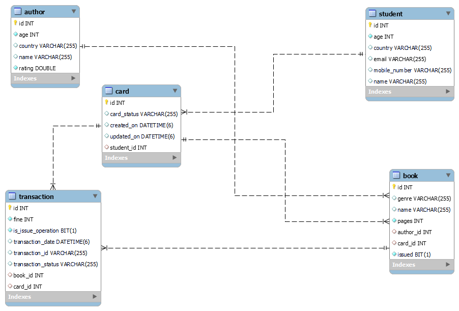

# Library Management System

## Table of contents

1. ###### [Technology Used](#techonology-used)

2. ###### [Schema](#schema)

3. ###### [Functionalities](#functionalities)

4. ###### [Postman Commands](#postman-commands)

## Techonology Used

- ###### Java

- ###### Spring Boot

- ###### Hibernate

- ###### RESTful APIs

- ###### Maven

- ###### My SQL

- ###### Postman

## EER Diagram

## Functionalities

###### Student

	• Create Student
		○ Create Card
	• Update Mobile Number of Student
	• Get Student Details

###### Author

	• Create Author
	• Get Author details

###### Book

	• Create Book

###### Transaction

	• Issue a book
		○ Check whether book is Available or not + Is Limit reached or not
		○ Mark book as Unavailable
		○ Link the book with card
		○ Add transaction entry in the table
	• Return a book
		○ Mark book as available
		○ Unlink the book with card
		○ Calculate fine if any
		○ Add transaction entry in the table
	• Get Transactions info

## Postman Commands

###### To Create Student:

	localhost:8080/student/add

	{
	    "name": "String",
	    "country": "String",
	    "age": int,
	    "mobileNumber": "String",
	    "email": "String"
	}

###### To Update Mobile Number of Student:

	localhost:8080/student/update-mobNo

###### To Get Student Details Through Email:

	localhost:8080/student/get-user?email=RequestParam

###### To Add Author:

	localhost:8080/author/add

	{
	    "name": "String",
	    "country": "String",
	    "age": int,
	    "rating": double
	}

###### To Add Book:

	localhost:8080/book/add

	{
	    "name": "String",
	    "authorId": int,
	    "pages": int,
	    "genre": "ENUM Type"
	}

###### To Get Author Details:

	localhost:8080/author/get-author?authorId=RequestParam

###### To Issue Book:

	localhost:8080/transaction/issueBook

	{
	    "bookId": int,
	    "cardId": int
	}

###### To Return Book:

	localhost:8080/transaction/returnBook?cardId=int&bookId=int

	